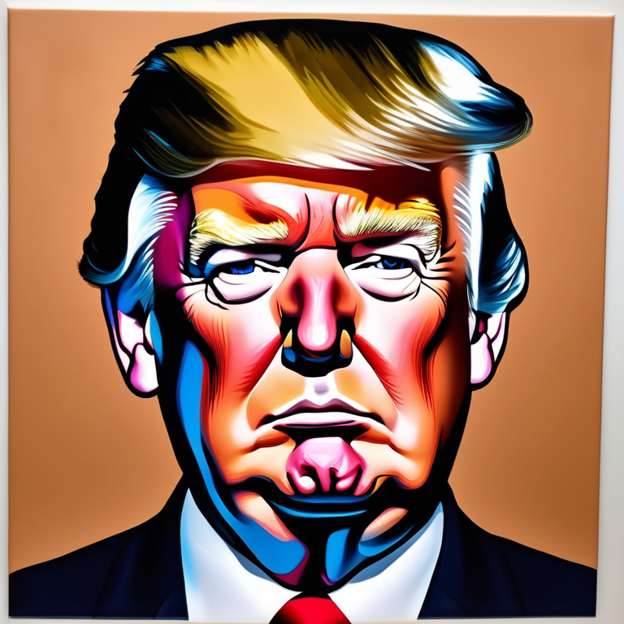
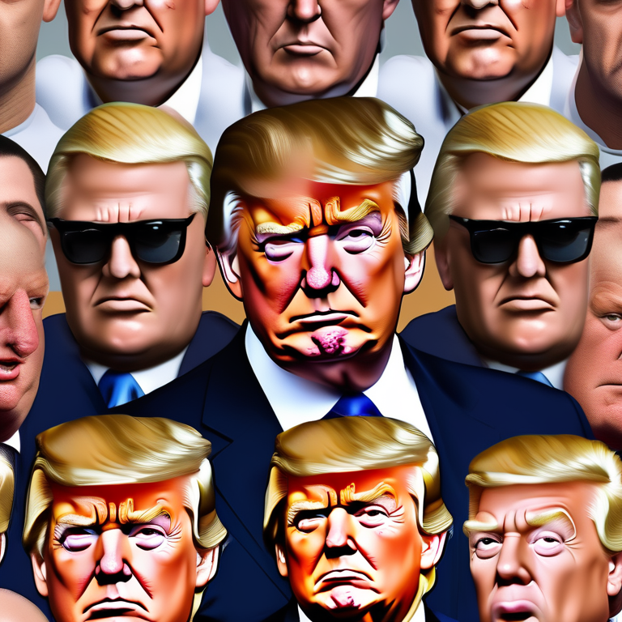

## 2D image pipeline.

### Input.

|                     |         |   |   |   |
|---------------------|---------|---|---|---|
| **Prompt**          |    `{character_name}`'s face, facing camera (0° angle), headshot, cartoon colours, gta v style, hyperrealism, a photorealistic painting, hyper realistic face, (clear white background:5)     |   |   |   |
| **Negative prompt** |    text, multicolored, black and white, signature, sig, (merged hands:1.3), (merged arms:1.3), merged, legs, merged bodyparts, BadDream, (UnrealisticDream:1.2), bad_prompt_version2, bad-artist bad-artist-anime, EasyNegative , longbody, lowres, bad anatomy, bad hands, missing fingers, extra digit, fewer digits, cropped, worst quality, low quality, multiple people     |   |   |   |
| **Input image**     |         |   |   |   |
| **Style image**     | _Empty_ |   |   |   |

### Output.

   

## Performance.

### 3D stage.

120s (cold boot) + 30s (first run) + 120s (gen/inference) = 270s per generation. This is based on Nvidia A40 (Large) GPU. Trialed with Nvidia A100 (80GB) GPU which gave run times of 109.5s and 130.25s.